# ConsultEase System Architecture

## How to Use This Diagram

### Option 1: Mermaid Live Editor (Recommended)
1. Go to [Mermaid Live Editor](https://mermaid.live/)
2. Copy the simplified diagram code below
3. Paste it into the editor
4. View and export the diagram

### Option 2: GitHub/GitLab
- GitHub and GitLab automatically render Mermaid diagrams in markdown files
- Just commit this file and view it in your repository

### Option 3: VS Code Extension
- Install the "Mermaid Preview" extension
- Open this file and use the preview feature

### Option 4: Online Documentation
- Most documentation platforms (GitBook, Notion, etc.) support Mermaid

## Ultra-Simple Architecture (Compatible with Basic Mermaid)

## System Flow (Step by Step)

## Hardware Components

## Communication Flow

## Simplified Compatible Diagram

```mermaid
graph TB
    %% Hardware Components
    subgraph Hardware["🔧 Hardware Components"]
        RPI["Raspberry Pi 4<br/>Touchscreen + RFID"]
        ESP1["ESP32 Unit 1<br/>TFT Display"]
        ESP2["ESP32 Unit 2<br/>TFT Display"]
        ESP3["ESP32 Unit 3<br/>TFT Display"]
        BEACON1["BLE Beacon 1"]
        BEACON2["BLE Beacon 2"] 
        BEACON3["BLE Beacon 3"]
    end

    %% Central System
    subgraph Central["🏠 Central System"]
        UI["Student/Admin UI"]
        Controllers["Controllers Layer"]
        Services["Services Layer"]
        Database["PostgreSQL DB"]
    end

    %% Communication
    subgraph Communication["📡 Communication"]
        MQTT["MQTT Broker"]
        BLE["BLE Protocol"]
        WiFi["WiFi Network"]
    end

    %% Connections
    RPI --> UI
    UI --> Controllers
    Controllers --> Services
    Services --> Database
    Services --> MQTT
    
    MQTT --> ESP1
    MQTT --> ESP2
    MQTT --> ESP3
    
    BEACON1 -.-> ESP1
    BEACON2 -.-> ESP2
    BEACON3 -.-> ESP3
    
    ESP1 --> WiFi
    ESP2 --> WiFi
    ESP3 --> WiFi
    WiFi --> MQTT
```

## Alternative: Network Topology Diagram

## Data Flow Diagram

## Comprehensive System Architecture Diagram

## System Component Details

### 🔧 Hardware Components

**Central System (Raspberry Pi 4)**
- **Purpose**: Main system controller and user interface
- **Components**: 10.1" touchscreen, USB RFID reader, WiFi/Ethernet
- **Technologies**: Linux (Bookworm 64-bit), Python 3.9+, PyQt5

**ESP32 Faculty Desk Units**
- **Purpose**: Faculty-specific displays and presence detection
- **Components**: 2.4" TFT display (ST7789), response buttons, BLE scanner
- **Technologies**: Arduino C++, WiFi, MQTT client, BLE scanning

**nRF51822 BLE Beacons**
- **Purpose**: Faculty presence detection
- **Function**: Continuous BLE advertising with unique MAC addresses
- **Detection**: ESP32 units scan for specific beacon MAC addresses

### 📱 Software Architecture

**Frontend Layer (PyQt5)**
- Student interface for consultation requests
- Admin dashboard for system management
- Touch-optimized UI with on-screen keyboard support

**Backend Services**
- **MQTT Service**: Asynchronous communication with faculty desk units
- **Database Manager**: PostgreSQL connection pooling and query optimization
- **RFID Service**: Student authentication via RFID cards
- **System Health**: Performance monitoring and error tracking

**Database Layer (PostgreSQL)**
- Faculty information with BLE beacon mapping
- Student records and RFID authentication
- Consultation request tracking and history
- Admin accounts with security audit logging

### 📡 Communication Protocols

**MQTT (Message Queuing Telemetry Transport)**
- **Broker**: Mosquitto running on Raspberry Pi
- **Topics**: 
  - `consultease/faculty/{id}/messages` - Consultation requests to faculty
  - `consultease/faculty/{id}/status` - Faculty presence status
  - `consultease/faculty/{id}/responses` - Faculty responses (Accept/Busy)
- **QoS**: Level 1 for reliable message delivery

**BLE (Bluetooth Low Energy)**
- **Scanning**: ESP32 units continuously scan for faculty beacons
- **Detection**: MAC address-based presence validation
- **Thresholds**: RSSI filtering and debounce logic for stable detection

**WiFi Network**
- **Infrastructure**: Local network connecting all ESP32 units to central system
- **Security**: WPA2/WPA3 encryption for network security

### 🔄 Key Data Flows

1. **Student Authentication**: RFID card → RFID Service → Database lookup → UI authentication

2. **Consultation Request**: Student UI → Consultation Controller → MQTT Service → Faculty Desk Unit → TFT Display

3. **Faculty Presence Detection**: nRF51822 Beacon → ESP32 BLE Scanner → MQTT Status → Central System → Database Update

4. **Faculty Response**: Button Press → ESP32 → MQTT Response → Central System → Student Notification

5. **System Monitoring**: Health Service → Performance Metrics → Admin Dashboard → Real-time Alerts

### 🎯 Key Integrations

- **Admin Dashboard**: Complete system management with real-time monitoring
- **Faculty Management**: Automated presence detection with manual override options
- **Consultation Panel**: Queue management with priority handling
- **Audit Logging**: Complete security audit trail for compliance
- **Touch Interface**: Mobile-friendly UI with accessibility features

This architecture provides a robust, scalable solution for student-faculty consultation management with real-time presence detection and seamless communication across all system components.

## Research Defense - System Architecture Diagram

### Simplified Yet Comprehensive Architecture

```mermaid
graph TB
    %% Student Layer
    Student[👤 Student]
    RFID[💳 RFID Authentication]
    
    %% Central System
    CentralSystem[🖥️ Raspberry Pi 4 Central System<br/>PyQt5 Interface<br/>RFID Reader<br/>Database Manager]
    Database[(🗄️ PostgreSQL Database<br/>Faculty<br/>Students<br/>Consultations)]
    Admin[👨‍💼 Admin Dashboard<br/>System Monitor<br/>Faculty Management]
    
    %% Communication Hub
    MQTT[📡 MQTT Broker<br/>Real-time Messaging]
    WiFi[🌐 WiFi Network<br/>System Connectivity]
    
    %% Faculty Desk Units
    ESP32_A[📺 ESP32 Faculty Unit A<br/>TFT Display<br/>Accept/Busy Buttons]
    ESP32_B[📺 ESP32 Faculty Unit B<br/>TFT Display<br/>Accept/Busy Buttons]
    ESP32_C[📺 ESP32 Faculty Unit C<br/>TFT Display<br/>Accept/Busy Buttons]
    
    %% BLE Presence System
    Beacon_A[📶 BLE Beacon A<br/>Faculty Presence Detection]
    Beacon_B[📶 BLE Beacon B<br/>Faculty Presence Detection]
    Beacon_C[📶 BLE Beacon C<br/>Faculty Presence Detection]
    
    %% Faculty
    Faculty_A[👨‍🏫 Faculty A]
    Faculty_B[👨‍🏫 Faculty B]
    Faculty_C[👨‍🏫 Faculty C]
    
    %% Main Flow: Student Authentication
    Student --> RFID
    RFID --> CentralSystem
    
    %% Central System Operations
    CentralSystem --> Database
    CentralSystem --> Admin
    CentralSystem --> MQTT
    
    %% Communication Network
    MQTT --> WiFi
    WiFi --> ESP32_A
    WiFi --> ESP32_B
    WiFi --> ESP32_C
    
    %% Faculty Desk Units to Faculty
    ESP32_A --> Faculty_A
    ESP32_B --> Faculty_B
    ESP32_C --> Faculty_C
    
    %% BLE Presence Detection
    Beacon_A -.->|Presence Detection| ESP32_A
    Beacon_B -.->|Presence Detection| ESP32_B
    Beacon_C -.->|Presence Detection| ESP32_C
    
    %% Faculty Carries Beacons
    Faculty_A -.->|Carries| Beacon_A
    Faculty_B -.->|Carries| Beacon_B
    Faculty_C -.->|Carries| Beacon_C
    
    %% Response Flow Back
    Faculty_A --> ESP32_A
    Faculty_B --> ESP32_B
    Faculty_C --> ESP32_C
    
    ESP32_A --> MQTT
    ESP32_B --> MQTT
    ESP32_C --> MQTT
    
    %% Final Response to Student
    MQTT --> CentralSystem
    CentralSystem --> Student
```

## System Overview for Research Defense

### 🎯 **Core Functionality**
ConsultEase automates student-faculty consultation requests using IoT technology with real-time presence detection and instant communication.

### 🏗️ **System Architecture**

**Central Hub (Raspberry Pi 4)**
- Student interface with touchscreen and RFID authentication
- PostgreSQL database for all system data
- MQTT broker for real-time communication
- Admin dashboard for system management

**Faculty Desk Units (ESP32)**
- Individual display units for each faculty member
- TFT screen shows incoming consultation requests
- Physical buttons for Accept/Busy responses
- Built-in BLE scanner for presence detection

**Presence Detection System (nRF51822 BLE Beacons)**
- Each faculty member carries a unique BLE beacon
- ESP32 units continuously scan for faculty presence
- Automatic status updates when faculty arrive/leave

### 🔄 **System Workflow**

1. **Student Authentication**: RFID card scan for system access
2. **Faculty Selection**: Choose from available faculty on touchscreen
3. **Request Delivery**: MQTT sends consultation request to faculty desk unit
4. **Presence Verification**: ESP32 scans for faculty BLE beacon
5. **Faculty Response**: Physical button press (Accept/Busy)
6. **Instant Feedback**: Response sent back to student interface

### 💡 **Key Innovations**

**Automated Presence Detection**
- BLE beacons eliminate manual status updates
- Real-time faculty availability tracking
- Reduces student waiting time

**IoT Integration**
- MQTT protocol for reliable messaging
- WiFi-connected distributed system
- Scalable architecture for multiple faculty

**User-Friendly Interface**
- Touch-optimized design for accessibility
- RFID authentication for quick access
- Visual feedback for all interactions

### 📊 **Technical Stack**

**Hardware**: Raspberry Pi 4, ESP32, nRF51822 BLE Beacons, RFID Reader
**Software**: Python PyQt5, Arduino C++, PostgreSQL, Mosquitto MQTT
**Protocols**: MQTT, BLE, WiFi, RFID
**Features**: Real-time messaging, presence detection, touch interface

### 🏆 **System Benefits**

- **Efficiency**: Automated request handling and instant responses
- **Availability**: Real-time faculty presence tracking
- **Accessibility**: Touch-friendly interface with RFID authentication
- **Scalability**: Easy expansion for additional faculty members
- **Reliability**: Multiple communication protocols ensure system robustness 